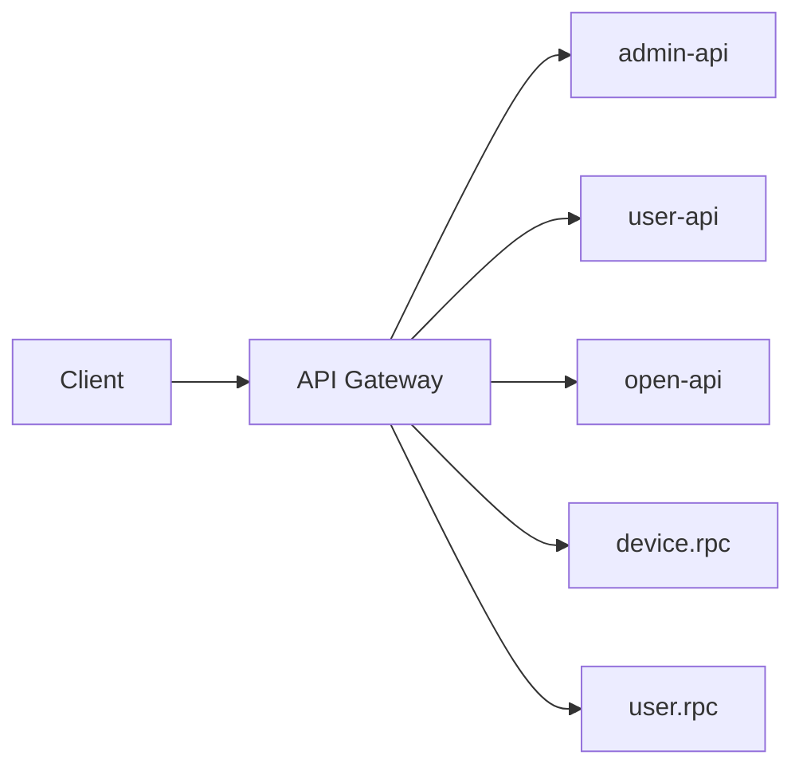

# API网关聚合接口设计方案

## 项目现状分析

通过分析项目结构和配置文件，我们发现该项目包含多个微服务：

1. **admin-api** - 管理后台服务，提供设备和产品管理功能
2. **user-api** - 用户服务，提供用户登录功能
3. **open-api** - 开放平台服务，提供消息发送功能
4. **device.rpc** - 设备RPC服务
5. **user.rpc** - 用户RPC服务

这些服务各自独立运行在不同的端口上，客户端需要直接访问各个服务的地址。目前项目中缺少统一的API网关来聚合这些服务接口。

## API网关需求

为了提升系统的可维护性和用户体验，建议添加一个API网关来：
1. 统一入口，简化客户端调用
2. 聚合多个服务的接口
3. 提供跨域支持、认证鉴权等通用功能
4. 实现请求路由、负载均衡等功能

## 技术选型

推荐使用以下技术栈实现API网关：
- **Go语言** - 与现有项目保持一致
- **Gin框架** - 高性能HTTP Web框架
- **Consul或Etcd** - 服务发现（项目中已使用Etcd）

## 架构设计

## 功能规划

### 1. 路由聚合
将各服务的接口统一映射到网关路径下：
- `/admin/*` -> 转发到admin-api服务
- `/user/*` -> 转发到user-api服务
- `/open/*` -> 转发到open-api服务
- `/device/*` -> 转发到device.rpc服务
- `/user-rpc/*` -> 转发到user.rpc服务

### 2. 认证鉴权
- 对需要认证的接口进行Token验证
- 集成现有的user.rpc服务进行用户认证

### 3. 日志记录
- 记录所有经过网关的请求日志
- 包含请求时间、路径、状态码等信息

### 4. 限流功能
- 对特定接口或用户进行请求频率限制

## 实施步骤

1. 创建新的gateway服务模块
2. 配置路由转发规则
3. 集成认证鉴权机制
4. 添加日志记录功能
5. 实现限流功能
6. 部署并测试

## 预期效果

通过添加API网关，可以：
1. 简化客户端开发，只需对接一个统一入口
2. 提高系统安全性，集中处理认证鉴权
3. 增强系统可观测性，统一收集请求日志
4. 便于后续扩展新功能和服务
